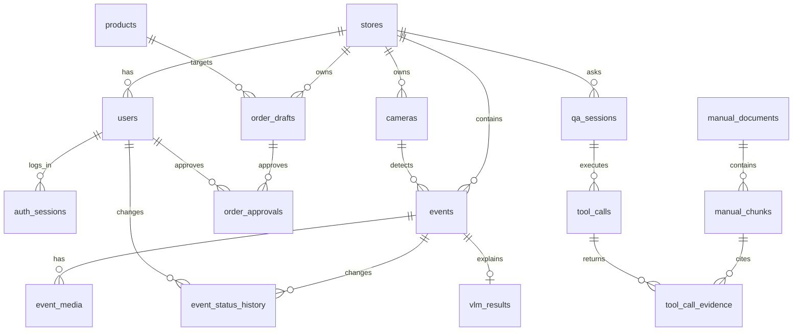

# StoreOps AI 데이터베이스 설계서

## 1. 문서 정보

| 항목      | 내용                                                         |
| --------- | ------------------------------------------------------------ |
| 문서 버전 | v0.2                                                         |
| 기준 문서 | `StoreOps_AI_요구사항_명세서.md`, `서버_개발_착수_가이드.md` |
| 대상 DB   | PostgreSQL 16 이상                                           |
| 선택 확장 | `pgvector`                                                   |
| 시간 기준 | 애플리케이션과 DB 세션은 `Asia/Seoul`, 컬럼은 `timestamptz`  |
| 설계 범위 | 회원가입·세션 인증, 사건, 발주, 질문 Agent, 매뉴얼 검색      |

이 설계서는 현재 메모리 저장소를 PostgreSQL 영속 저장소로 교체하기 위한 기준이다. 영상과 사진의 실제 바이너리는 파일 저장소에 두고, DB에는 URI와 메타데이터만 저장한다.

회원가입과 세션 인증은 현재 FastAPI 구현을 따른다. 포트폴리오 초기 범위에서는 한 점주 계정이 하나의 매장에 속하도록 `users.store_id`로 직접 연결하며, 다중 매장 권한이 필요해질 때만 `store_members`를 추가한다.

## 2. 설계 원칙

1. 점주는 자신의 매장 데이터만 조회하고 변경한다. 모든 업무 테이블은 `store_id`를 가진다.
2. 사건 상태 변경, 발주 승인, Agent 도구 호출은 삭제하거나 덮어쓰지 않고 이력을 추가한다.
3. 사건 생성은 VLM 처리와 분리한다. VLM 실패가 사건 본체 저장을 롤백하지 않도록 한다.
4. 카메라 끊김 사건은 영상·행동 점수를 저장하지 않는다. DB 제약조건으로 이 규칙을 보조한다.
5. 모의·합성·실제 자료의 구분을 `data_label`과 원천 메타데이터로 남긴다.
6. `timestamptz`로 시각을 저장하고 API 응답은 `+09:00` 형식으로 직렬화한다. PostgreSQL 내부 표현은 UTC일 수 있으므로 문자열 저장은 사용하지 않는다.
7. 질문 Agent에는 변경 권한을 주지 않는다. Agent 관련 테이블은 조회 실행과 결과 추적만 저장한다.
8. 비밀번호 원문과 세션 토큰 원문은 저장하지 않는다. 각각 비밀번호 해시와 세션 토큰 해시만 저장한다.

## 3. 논리 모델



### 3.1 주요 식별자

| 대상        | 식별자       | 규칙                                         |
| ----------- | ------------ | -------------------------------------------- |
| 매장        | `store_id`   | `S` + 숫자 2자리 이상, 예: `S01`             |
| 카메라      | `camera_id`  | 매장 내 유일, 예: `CAM-01`                   |
| 사건        | `event_id`   | `E` + 숫자 3자리 이상, 애플리케이션에서 발급 |
| 발주 초안   | `draft_id`   | UUID                                         |
| 질문 세션   | `session_id` | UUID                                         |
| 매뉴얼 조각 | `chunk_id`   | 문서 버전 내 유일, 예: `M001-C03`            |

## 4. 테이블 설계

### 4.1 기준정보와 접근 제어

#### `stores`

매장 기본 정보와 활성 상태를 저장한다.

| 컬럼         | 타입           | 제약                        | 설명        |
| ------------ | -------------- | --------------------------- | ----------- |
| `store_id`   | `varchar(32)`  | PK                          | 매장 번호   |
| `name`       | `varchar(120)` | NOT NULL                    | 매장명      |
| `timezone`   | `varchar(64)`  | NOT NULL, 기본 `Asia/Seoul` | 매장 시간대 |
| `is_active`  | `boolean`      | NOT NULL, 기본 `true`       | 사용 여부   |
| `created_at` | `timestamptz`  | NOT NULL                    | 생성 시각   |

#### `users`, `auth_sessions`

회원가입 시 `stores`와 `users`를 함께 생성한다. 사용자는 자신의 `store_id`에 해당하는 기록만 조회·변경할 수 있다. 로그인 성공 시 서버가 무작위 세션 ID를 발급하고, 클라이언트는 이후 요청의 `X-Session-ID` 헤더로 전달한다.

| 테이블          | 주요 컬럼                                                                                                                      |
| --------------- | ------------------------------------------------------------------------------------------------------------------------------ |
| `users`         | `user_id uuid PK`, `store_id FK`, `email UNIQUE`, `password_hash`, `display_name`, `role` (`owner`), `is_active`, `created_at` |
| `auth_sessions` | `session_id uuid PK`, `user_id FK`, `session_token_hash UNIQUE`, `expires_at`, `created_at`, `last_seen_at`, `revoked_at`      |

로그아웃 시 `auth_sessions.revoked_at`을 기록한다. 만료되거나 폐기된 세션은 보호 API를 호출할 수 없다.

### 4.2 사건 영역

#### `cameras`

| 컬럼            | 타입           | 제약         | 설명               |
| --------------- | -------------- | ------------ | ------------------ |
| `camera_id`     | `varchar(32)`  | PK           | 카메라 번호        |
| `store_id`      | `varchar(32)`  | FK, NOT NULL | 소속 매장          |
| `name`          | `varchar(120)` | NOT NULL     | 표시 이름          |
| `is_connected`  | `boolean`      | NOT NULL     | 현재 연결 상태     |
| `last_frame_at` | `timestamptz`  | NULL         | 마지막 프레임 시각 |
| `updated_at`    | `timestamptz`  | NOT NULL     | 상태 갱신 시각     |

#### `events`

사건 후보의 현재 상태와 최초 탐지 결과를 저장한다. `scores`는 다섯 분류 점수의 원본 JSON을 보존하고, 조회 조건이 필요한 값은 별도 컬럼으로 둔다.

| 컬럼            | 타입           | 제약                | 설명                                                              |
| --------------- | -------------- | ------------------- | ----------------------------------------------------------------- |
| `event_id`      | `varchar(16)`  | PK                  | 사건 번호                                                         |
| `store_id`      | `varchar(32)`  | FK, NOT NULL        | 매장 격리 기준                                                    |
| `camera_id`     | `varchar(32)`  | FK, NOT NULL        | 발생 카메라                                                       |
| `source`        | `varchar(32)`  | CHECK               | `behavior_model` 또는 `time_rule`                                 |
| `event_type`    | `varchar(32)`  | NOT NULL            | `fall`, `fight`, `vandalism`, `littering`, `camera_disconnect` 등 |
| `occurred_at`   | `timestamptz`  | NOT NULL            | 발생 시각                                                         |
| `status`        | `varchar(16)`  | CHECK               | `unconfirmed`, `confirmed`, `resolved`, `false_alarm`             |
| `scores`        | `jsonb`        | NOT NULL, 기본 `{}` | 행동 분류 점수                                                    |
| `threshold`     | `numeric(5,4)` | 0~1 또는 NULL       | 행동 기준값                                                       |
| `gap_sec`       | `integer`      | 0 이상 또는 NULL    | 끊김 시간                                                         |
| `threshold_sec` | `integer`      | 0 이상 또는 NULL    | 끊김 기준 시간                                                    |
| `data_label`    | `varchar(16)`  | CHECK               | `real`, `synthetic`, `mock`                                       |
| `created_at`    | `timestamptz`  | NOT NULL            | 저장 시각                                                         |
| `updated_at`    | `timestamptz`  | NOT NULL            | 최종 수정 시각                                                    |

권장 제약조건:

- `source = 'time_rule'`이면 `event_type = 'camera_disconnect'`, `scores = '{}'`, `threshold IS NULL`, `gap_sec`와 `threshold_sec`는 NOT NULL이다.
- `source = 'behavior_model'`이면 `event_type <> 'camera_disconnect'`, `gap_sec IS NULL`, `threshold IS NOT NULL`이다.
- 사건 생성 시 `status = 'unconfirmed'`만 허용한다.

#### `event_media`, `vlm_results`, `event_status_history`

| 테이블                 | 설계                                                                                                                                                                                                          |
| ---------------------- | ------------------------------------------------------------------------------------------------------------------------------------------------------------------------------------------------------------- |
| `event_media`          | `media_id uuid PK`, `event_id FK`, `media_type` (`clip`, `frame_start`, `frame_middle`, `frame_end`), `uri`, `length_sec`, `created_at`. 끊김 사건에는 행을 만들지 않는다.                                    |
| `vlm_results`          | `event_id PK/FK`, `status` (`pending`, `completed`, `failed`, `not_applicable`), `model_name`, `observed`, `uncertain`, `owner_checks`, `missing_fields jsonb`, `error_message`, `completed_at`, `updated_at` |
| `event_status_history` | `history_id bigserial PK`, `event_id FK`, `from_status`, `to_status`, `changed_by FK`, `changed_at`, `reason`. 상태 전이 검증은 서비스에서 수행하고 DB에는 원본 이력을 보존한다.                              |

### 4.3 발주 영역

#### `products`

`product_id`, `product_name`, `unit_name`, `default_pack_size`, `data_label`, `created_at`를 저장한다. 발주 초안에 계산 당시의 포장 단위를 복사해 두어 상품 설정 변경 후에도 과거 계산을 재현한다.

#### `order_drafts`

| 컬럼                                           | 타입            | 설명                                                         |
| ---------------------------------------------- | --------------- | ------------------------------------------------------------ |
| `draft_id`                                     | `uuid`          | PK                                                           |
| `store_id`, `product_id`                       | `varchar(32)`   | 각각 `stores`, `products` FK                                 |
| `target_date`                                  | `date`          | 예측 대상일                                                  |
| `forecast_d1`, `forecast_d2`, `forecast_total` | `numeric(12,2)` | 내일, 모레, 합계                                             |
| `safety_stock`, `on_hand`, `incoming`          | `numeric(12,2)` | 계산 입력값                                                  |
| `need`                                         | `numeric(12,2)` | `max(forecast_total + safety_stock - on_hand - incoming, 0)` |
| `pack_size`                                    | `integer`       | 당시 박스 단위                                               |
| `recommended_qty`, `recommended_boxes`         | `integer`       | 추천 개수와 박스                                             |
| `shortage_before_arrival`                      | `numeric(12,2)` | 도착 전 부족 수량                                            |
| `status`                                       | `varchar(16)`   | `draft`, `approved`, `cancelled`                             |
| `data_label`                                   | `varchar(16)`   | `real`, `synthetic`, `mock`                                  |
| `sent_to_supplier`                             | `boolean`       | NOT NULL, 항상 `false`                                       |
| `created_at`, `updated_at`                     | `timestamptz`   | 생성·수정 시각                                               |

`store_id`, `product_id`, `target_date`에 유일 인덱스를 두되, 재계산 이력을 남겨야 하면 `calculation_run_id`를 추가해 여러 초안을 허용한다.

#### `order_approvals`

`approval_id bigserial PK`, `draft_id FK`, `approved_qty`, `approved_boxes`, `approved_by FK`, `approved_at`, `note`를 저장한다. 승인 시 `sent_to_supplier`나 재고 테이블을 변경하지 않는다. 동일 초안의 승인 중복은 서비스 트랜잭션과 `UNIQUE(draft_id)`로 막는다.

### 4.4 질문 Agent와 매뉴얼 영역

#### `qa_sessions`

`session_id uuid PK`, `store_id FK`, `asked_by FK`, `question`, `answer`, `query_conditions jsonb`, `stop_reason`, `status` (`running`, `completed`, `failed`, `stopped`), `created_at`, `completed_at`를 저장한다. `answer`에는 개인정보나 인물 식별 정보를 넣지 않는다.

#### `tool_calls`

`tool_call_id bigserial PK`, `session_id FK`, `step_no`, `tool_name`, `input jsonb`, `result_status` (`ok`, `empty`, `error`, `not_received`, `rejected`), `output jsonb`, `reason`, `rejected_reason`, `called_at`, `duration_ms`를 저장한다.

`tool_name`은 `query_records`, `search_manual`, `get_event_video`만 허용한다. 애플리케이션의 허용 목록과 DB CHECK를 함께 적용한다.

#### `manual_documents`, `manual_chunks`, `tool_call_evidence`

문서 버전과 조각을 분리한다. 문서가 개정되면 기존 버전을 삭제하지 않고 새 버전을 추가한다.

| 테이블               | 주요 컬럼                                                                                                                                 |
| -------------------- | ----------------------------------------------------------------------------------------------------------------------------------------- |
| `manual_documents`   | `document_id uuid PK`, `doc_code` (`M001`), `doc_name`, `doc_version`, `status`, `created_at`; `UNIQUE(doc_code, doc_version)`            |
| `manual_chunks`      | `chunk_id varchar(64) PK`, `document_id FK`, `section`, `text`, `embedding vector(차원은 모델 확정 후 고정)`, `chunk_order`, `created_at` |
| `tool_call_evidence` | `tool_call_id FK`, `chunk_id FK`, `similarity numeric`, 복합 PK (`tool_call_id`, `chunk_id`)                                              |

`manual_chunks`에는 pgvector HNSW 또는 IVFFlat 인덱스를 적용한다. 임베딩 모델이 확정되기 전에는 벡터 차원을 코드와 마이그레이션에 하드코딩하지 않는다.

### 4.5 공통 설정과 감사

#### `system_configs`

`config_key PK`, `config_value jsonb`, `description`, `updated_by FK`, `updated_at`를 저장한다. 예시는 `event.behavior_threshold=0.60`, `camera.disconnect_threshold_sec=60`, `order.safety_stock=10`, `order.pack_size=6`, `agent.max_tool_calls=5`이다. 변경 전후 값은 `audit_logs`에 기록한다.

#### `audit_logs`

`audit_id bigserial PK`, `store_id`, `actor_type` (`user`, `agent`, `system`), `actor_id`, `action`, `entity_type`, `entity_id`, `before_data jsonb`, `after_data jsonb`, `reason`, `created_at`를 저장한다. 운영상 필요한 기간 동안 보존하고 일반 업무 API에서는 수정·삭제하지 않는다.

## 5. 관계 및 무결성 규칙

| 규칙           | 적용 방법                                                                                                                         |
| -------------- | --------------------------------------------------------------------------------------------------------------------------------- |
| 매장 격리      | 세션으로 조회한 사용자의 `store_id`를 기준으로 모든 조회에 매장 조건 강제. 운영 단계에서는 Row-Level Security 검토                |
| 사건 상태 전이 | 서비스의 허용 집합 `unconfirmed→confirmed→resolved`, `unconfirmed→false_alarm`; DB 트리거 또는 서비스 트랜잭션으로 동시 변경 방지 |
| 사건 이력      | 상태 변경과 이력 INSERT를 하나의 트랜잭션으로 수행                                                                                |
| VLM 비동기     | 사건 INSERT 후 별도 작업이 `vlm_results`를 UPDATE; 사건 본체와 독립                                                               |
| 발주 승인      | `order_drafts` 잠금 후 승인 이력 INSERT 및 상태 UPDATE; 공급사 전송 컬럼은 false 고정                                             |
| 질문 종료      | 연속 실패 2회 또는 전체 호출 5회 초과를 서비스에서 감지하고 `qa_sessions.stop_reason` 저장                                        |
| 오류 구분      | `tool_calls.result_status`를 사용해 빈 결과와 오류를 구분                                                                         |
| 개인정보       | 추적 번호·얼굴 식별값·인물 프로필 컬럼을 만들지 않음. 영상 보관 정책과 동의서 메타데이터는 별도 운영 문서로 관리                  |

## 6. 인덱스 설계

```sql
CREATE INDEX ix_events_store_occurred
    ON events (store_id, occurred_at DESC);
CREATE INDEX ix_users_store
    ON users (store_id);
CREATE INDEX ix_auth_sessions_token
    ON auth_sessions (session_token_hash);
CREATE INDEX ix_auth_sessions_expiry
    ON auth_sessions (expires_at);
CREATE INDEX ix_events_store_status_occurred
    ON events (store_id, status, occurred_at DESC);
CREATE INDEX ix_events_camera_occurred
    ON events (camera_id, occurred_at DESC);
CREATE INDEX ix_event_history_event_changed
    ON event_status_history (event_id, changed_at DESC);
CREATE INDEX ix_order_drafts_store_target
    ON order_drafts (store_id, target_date DESC);
CREATE INDEX ix_qa_sessions_store_created
    ON qa_sessions (store_id, created_at DESC);
CREATE INDEX ix_tool_calls_session_step
    ON tool_calls (session_id, step_no);
```

JSONB 전체 검색은 초기 범위에서 사용하지 않는다. 검색 조건이 고정되면 일반 컬럼으로 승격한다. 모든 인덱스는 실제 조회량과 `EXPLAIN ANALYZE` 결과를 보고 조정한다.

## 7. PostgreSQL DDL 초안

아래 DDL은 핵심 사건 영역의 1차 마이그레이션 초안이다. 운영 적용 전 사용자 인증 방식, 임베딩 차원, ID 발급 방식에 따라 Alembic 마이그레이션으로 구체화한다.

```sql
CREATE EXTENSION IF NOT EXISTS pgcrypto;

CREATE TABLE stores (
    store_id varchar(32) PRIMARY KEY,
    name varchar(120) NOT NULL,
    timezone varchar(64) NOT NULL DEFAULT 'Asia/Seoul',
    is_active boolean NOT NULL DEFAULT true,
    created_at timestamptz NOT NULL DEFAULT now()
);

CREATE TABLE users (
    user_id uuid PRIMARY KEY DEFAULT gen_random_uuid(),
    store_id varchar(32) NOT NULL REFERENCES stores(store_id),
    email varchar(255) NOT NULL UNIQUE,
    password_hash text NOT NULL,
    display_name varchar(120) NOT NULL,
    role varchar(16) NOT NULL DEFAULT 'owner' CHECK (role = 'owner'),
    is_active boolean NOT NULL DEFAULT true,
    created_at timestamptz NOT NULL DEFAULT now()
);

CREATE TABLE auth_sessions (
    session_id uuid PRIMARY KEY DEFAULT gen_random_uuid(),
    user_id uuid NOT NULL REFERENCES users(user_id) ON DELETE CASCADE,
    session_token_hash text NOT NULL UNIQUE,
    expires_at timestamptz NOT NULL,
    created_at timestamptz NOT NULL DEFAULT now(),
    last_seen_at timestamptz NOT NULL DEFAULT now(),
    revoked_at timestamptz
);

CREATE TABLE cameras (
    camera_id varchar(32) PRIMARY KEY,
    store_id varchar(32) NOT NULL REFERENCES stores(store_id),
    name varchar(120) NOT NULL,
    is_connected boolean NOT NULL DEFAULT false,
    last_frame_at timestamptz,
    updated_at timestamptz NOT NULL DEFAULT now()
);

CREATE TABLE events (
    event_id varchar(16) PRIMARY KEY,
    store_id varchar(32) NOT NULL REFERENCES stores(store_id),
    camera_id varchar(32) NOT NULL REFERENCES cameras(camera_id),
    source varchar(32) NOT NULL CHECK (source IN ('behavior_model', 'time_rule')),
    event_type varchar(32) NOT NULL,
    occurred_at timestamptz NOT NULL,
    status varchar(16) NOT NULL DEFAULT 'unconfirmed'
        CHECK (status IN ('unconfirmed', 'confirmed', 'resolved', 'false_alarm')),
    scores jsonb NOT NULL DEFAULT '{}'::jsonb,
    threshold numeric(5,4) CHECK (threshold BETWEEN 0 AND 1),
    gap_sec integer CHECK (gap_sec >= 0),
    threshold_sec integer CHECK (threshold_sec >= 0),
    data_label varchar(16) NOT NULL DEFAULT 'mock'
        CHECK (data_label IN ('real', 'synthetic', 'mock')),
    created_at timestamptz NOT NULL DEFAULT now(),
    updated_at timestamptz NOT NULL DEFAULT now(),
    CHECK (
        (source = 'time_rule' AND event_type = 'camera_disconnect'
            AND scores = '{}'::jsonb AND threshold IS NULL
            AND gap_sec IS NOT NULL AND threshold_sec IS NOT NULL)
        OR
        (source = 'behavior_model' AND event_type <> 'camera_disconnect'
            AND gap_sec IS NULL AND threshold_sec IS NULL)
    )
);

CREATE TABLE event_media (
    media_id uuid PRIMARY KEY DEFAULT gen_random_uuid(),
    event_id varchar(16) NOT NULL REFERENCES events(event_id),
    media_type varchar(16) NOT NULL
        CHECK (media_type IN ('clip', 'frame_start', 'frame_middle', 'frame_end')),
    uri text NOT NULL,
    length_sec integer CHECK (length_sec >= 0),
    created_at timestamptz NOT NULL DEFAULT now(),
    UNIQUE (event_id, media_type)
);

CREATE TABLE event_status_history (
    history_id bigserial PRIMARY KEY,
    event_id varchar(16) NOT NULL REFERENCES events(event_id),
    from_status varchar(16) NOT NULL,
    to_status varchar(16) NOT NULL,
    changed_by uuid NOT NULL REFERENCES users(user_id),
    changed_at timestamptz NOT NULL DEFAULT now(),
    reason text
);

CREATE TABLE vlm_results (
    event_id varchar(16) PRIMARY KEY REFERENCES events(event_id),
    status varchar(20) NOT NULL CHECK (status IN ('pending', 'completed', 'failed', 'not_applicable')),
    model_name varchar(120),
    observed text,
    uncertain text,
    owner_checks text,
    missing_fields jsonb NOT NULL DEFAULT '[]'::jsonb,
    error_message text,
    completed_at timestamptz,
    updated_at timestamptz NOT NULL DEFAULT now()
);
```

## 8. API 및 현재 코드 매핑

| 현재 API/모델                                                                                                                                 | DB 매핑                                                               |
| --------------------------------------------------------------------------------------------------------------------------------------------- | --------------------------------------------------------------------- |
| `Event.event_id`, `store_id`, `camera_id`, `source`, `event_type`, `occurred_at`, `scores`, `threshold`, `gap_sec`, `threshold_sec`, `status` | `events`                                                              |
| `Event.clip.uri`, `length_sec`                                                                                                                | `event_media`의 `media_type='clip'`                                   |
| `Event.vlm`                                                                                                                                   | `vlm_results`                                                         |
| `EventStatusHistory`                                                                                                                          | `event_status_history`                                                |
| `GET /api/events`                                                                                                                             | `events` + `event_media`, `vlm_results` 조회                          |
| `POST /api/events/{event_id}/status`                                                                                                          | `events` UPDATE + `event_status_history` INSERT + `audit_logs` INSERT |
| `GET /api/orders/drafts`                                                                                                                      | `order_drafts` 조회                                                   |
| `POST /api/orders/drafts/{draft_id}/approve`                                                                                                  | `order_approvals` INSERT + `order_drafts.status` UPDATE               |
| `POST /api/ask`                                                                                                                               | `qa_sessions` 생성 + `tool_calls` 반복 INSERT                         |
| `GET /api/ask/{session_id}/log`                                                                                                               | `tool_calls`와 `tool_call_evidence` 조회                              |
| `POST /api/auth/signup`                                                                                                                       | `stores` INSERT + `users` INSERT                                      |
| `POST /api/auth/login`                                                                                                                        | `users` 조회 + `auth_sessions` INSERT + 세션 ID 발급                  |
| `POST /api/auth/logout`                                                                                                                       | `auth_sessions.revoked_at` 갱신                                       |
| `GET /api/auth/me`                                                                                                                            | `auth_sessions`와 `users` 조회                                        |

초기 구현은 기존 `EventRepository` 인터페이스를 유지한 `PostgresEventRepository`로 교체한다. 라우터와 서비스가 SQL을 직접 실행하지 않도록 Repository가 트랜잭션 경계를 맡는다.

## 9. 마이그레이션 및 운영 순서

1. PostgreSQL과 `pgvector`를 Docker Compose로 실행하고 `Asia/Seoul` 세션 시간대를 설정한다.
2. `stores`, `users`, `auth_sessions`, `cameras`를 생성하고 회원가입 또는 시드 데이터로 `S01`, `CAM-01`, `CAM-02`를 준비한다.
3. 사건 핵심 테이블과 인덱스를 생성한 뒤 현재 `E014`, `E015`를 `data_label='mock'`으로 이관한다.
4. Repository를 교체하고 사건 상태 전이 단위·통합 테스트를 PostgreSQL 테스트 DB에서 실행한다.
5. 발주, Agent, 매뉴얼 테이블을 단계별로 추가한다. 기능이 없는 테이블을 먼저 API에 노출하지 않는다.
6. 운영 전 백업·복구, 영상 URI 접근 권한, 보관 기간, RLS 도입 여부를 결정한다.

## 10. 미결정 사항

| 항목                                           | 결정 필요 시점                  |
| ---------------------------------------------- | ------------------------------- |
| 세션 만료 기간과 만료 세션 정리 주기           | API 인증 구현 전                |
| 사건 번호의 매장별/전체 연번 및 동시 발급 방식 | 사건 생성 API 구현 전           |
| 임베딩 모델과 벡터 차원                        | `manual_chunks` 마이그레이션 전 |
| 영상 파일 저장소와 보관·삭제 기간              | 실제 영상 연결 전               |
| 도착 전 부족 수량의 확정 산식                  | 발주 서비스 구현 전             |
| 승인 수량이 박스 배수가 아닐 때의 처리 규칙    | 발주 승인 API 구현 전           |
| 다중 매장 운영 시 `store_members` 도입 여부    | 운영 기능 확장 전               |

## 11. 검증 기준

- `E014` 조회 결과에 영상, 행동 점수, VLM 실행 결과가 포함되지 않는다.
- `E015`의 `unconfirmed → confirmed → resolved`와 `unconfirmed → false_alarm`만 성공한다.
- 상태 변경 1회마다 `event_status_history`가 정확히 1건 추가된다.
- 발주 승인 후 `sent_to_supplier=false`, 재고, 도착 예정 값이 변하지 않는다.
- Agent의 허용 외 도구 호출, 다른 매장 조회, 형식 오류가 `rejected`로 남는다.
- 조회 오류와 0건 결과가 서로 다른 `result_status`로 저장된다.
- 모든 업무 테이블의 매장 조건 누락 조회를 코드 리뷰와 통합 테스트로 차단한다.
- 동일 이메일은 회원가입할 수 없고 비밀번호 평문은 DB에 남지 않는다.
- 로그아웃하거나 만료된 세션으로 보호 API를 호출할 수 없다.
- 세션의 `store_id`로 다른 매장 사건·발주·질문을 조회할 수 없다.
- 마이그레이션 후 `python -m compileall app`, 백엔드 테스트, API 헬스 체크를 통과한다.
